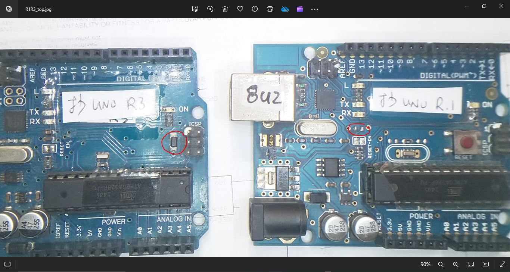
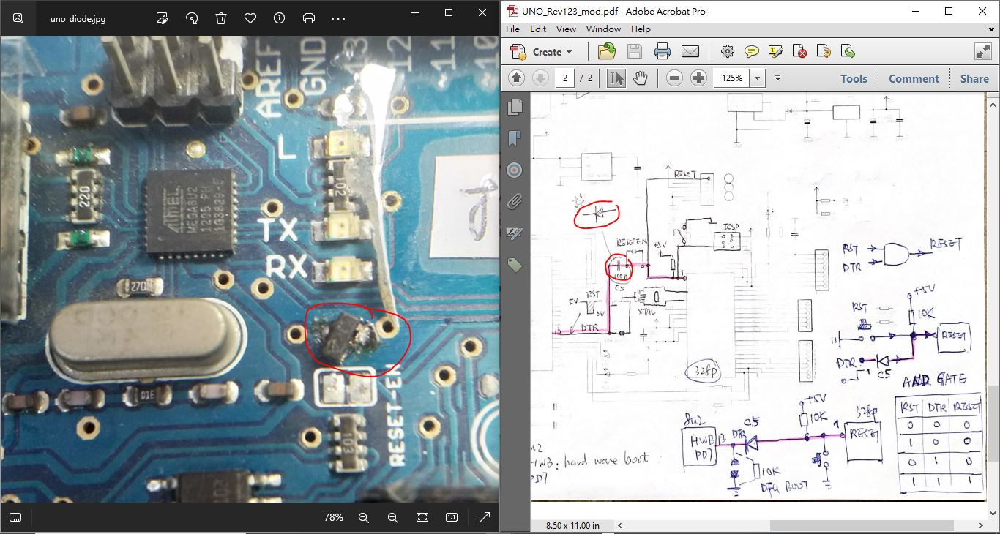
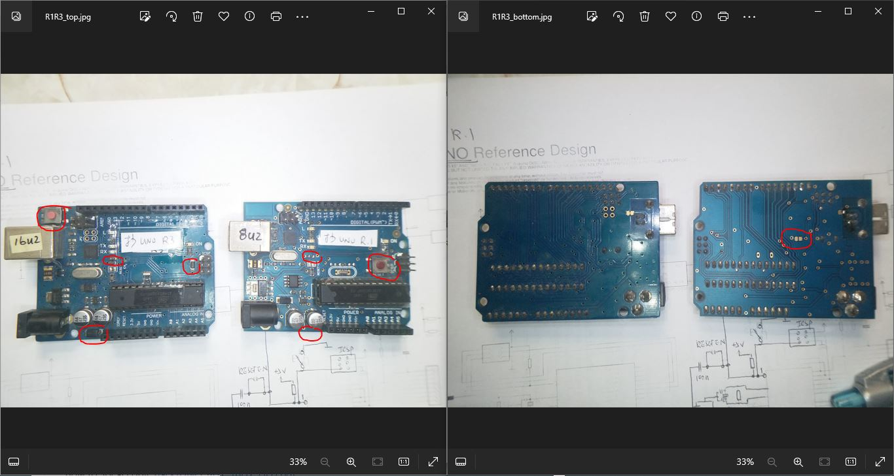
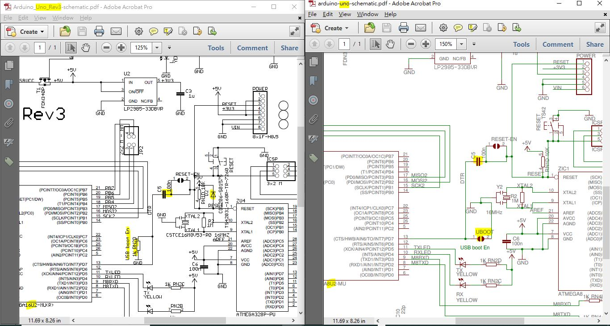
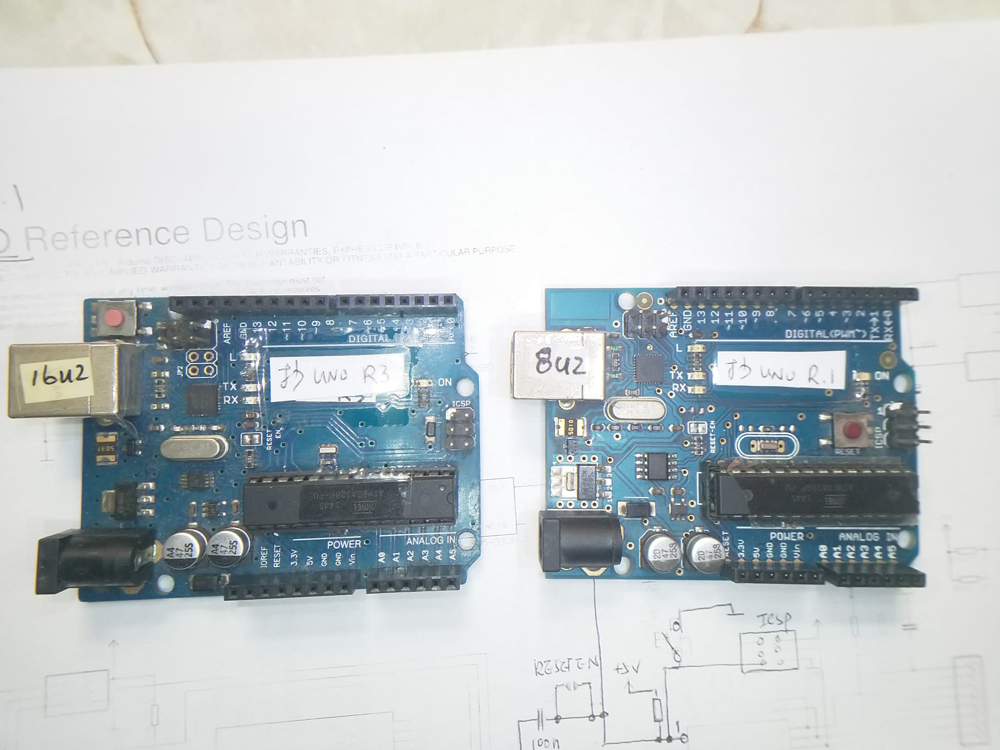
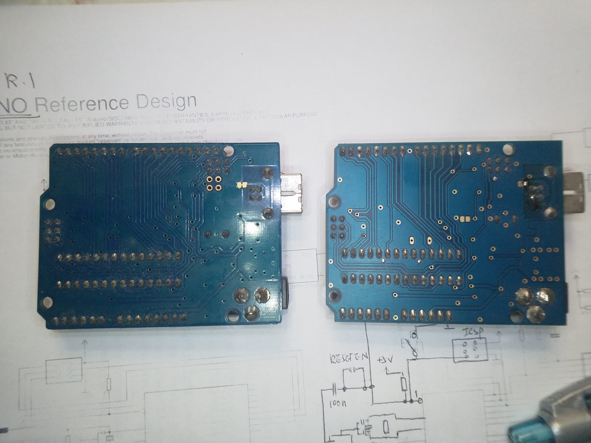
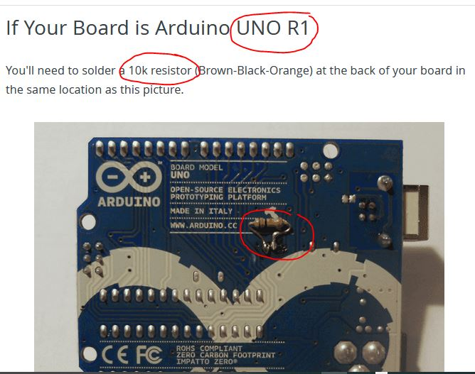
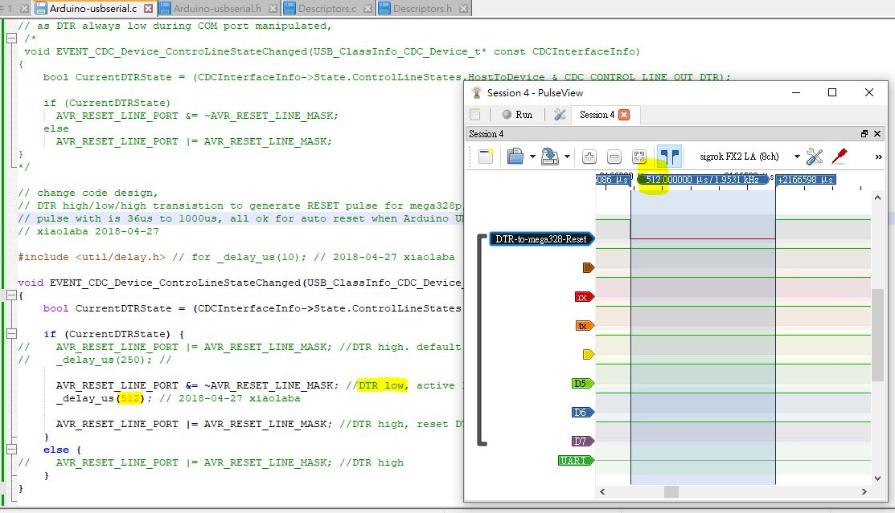
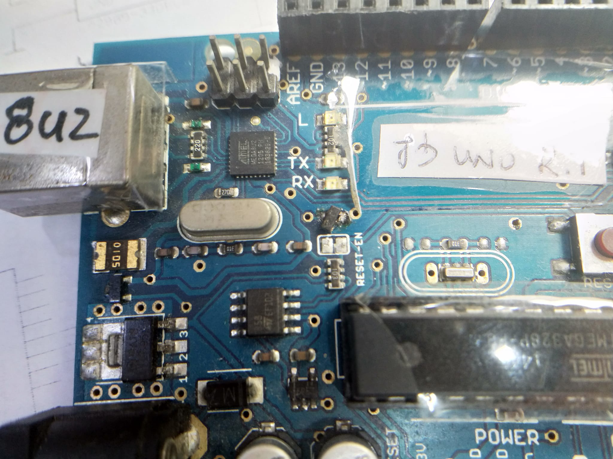
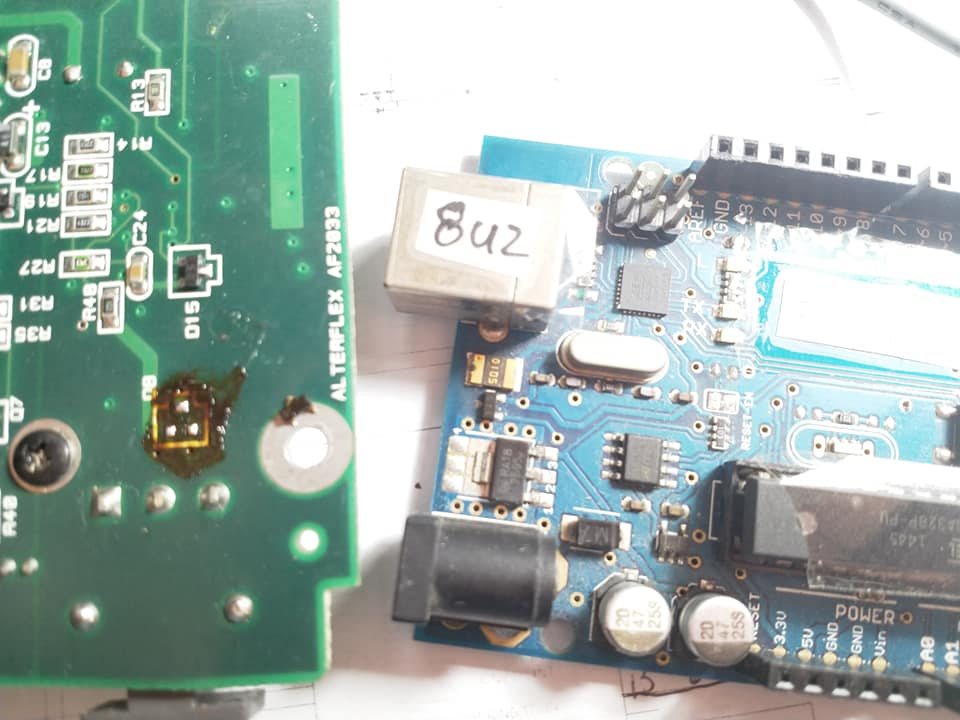

# UNO-R1-R3-reset-circuitry
Arduino clone broad, UNO not be able to download ? missing the DTR reset  
this is not good design anyway  


### makes it better
how and why was that working, the modified circuit design.  
#### the software,  
8u2-burn.bat, to brun Arduino-usbserial-atmega8u2-Uno-Rev1-PID_0x0001-xiaolaba.hex to the chip,  
burn_arduino_com8.bat, to burn 328p.hex to mega328p, or uses Arduino IDE,   
[hack/UNO_Rev1_2_3_mod.pdf](hack/UNO_Rev1_2_3_mod.pdf)    
C5, replaced by a SMT diode, actually it was unknown transistor with one leg trimmed off.  
  

Arduino UNO
USB VID_0x2341 PID_0x0043 REV_0x0001  


DTR provide reset signal, it is likely a charge pump circuit to the reset pin of Mega328 MCU  
UNO R.1, and UNO R.3, the RESET circuit via pullup 10K resistor and adding a diode to protect 328P, it is saying the malfunction and reliability had been compromised on UNO R.1









how to upgrade 8u2/16u2 firmware and why  
how to, local copy, [hack/UNO_8U2_16U2_DFU.pdf](hack/UNO_8U2_16U2_DFU.pdf)  
https://docs.arduino.cc/retired/hacking/software/DFUProgramming8U2/   
firmware  
https://github.com/arduino/ArduinoCore-avr/tree/master/firmwares/atmegaxxu2   

for adding 10k pull down resistor, not 1k as R3 used ?  



### a better way for mega328p & reset circuit
load the new firmware to 8u2 chip, [Arduino-usbserial-atmega8u2-Uno-Rev1-PID_0x0001-xiaolaba.hex](Arduino-usbserial-atmega8u2-Uno-Rev1-PID_0x0001-xiaolaba.hex)
replace the capacitor with a diode (the faulty board, the cap was missing missing anyway, the circuit
job done
  


### how to comply the firmnware for 8u2
donwload the code, this local copy [arduino-usb-master.zip](arduino-usb-master.zip)  
or clone from github https://github.com/harlequin-tech/arduino-usb, the author was saying that LUFA version 100807 was used.  
.  
linux and commands following,
```
sudo apt list --upgradable
sudo apt update
sudo apt upgrade
sudo apt-get install gcc-avr binutils-avr avr-libc dfu-programmer

avr-gcc -v
wget https://github.com/harlequin-tech/arduino-usb/archive/refs/heads/master.zip
unzip master.zip
cd arduino-usb-master/firmwares/arduino-usbserial
make
```

the firmware should be able to build upon completion


### how to get this very own firmware for 8u2 ?
go to folder firmwares\arduino-serial\  
patch 2 files and then complie the code again
patched copies,  
[Arduino-usbserial.c](Arduino-usbserial.c)    
[makefile](makefile)  


1. patch Arduino-usbserial.c  
```
/** Event handler for the CDC Class driver Host-to-Device Line Encoding Changed event.
 *
 *  \param[in] CDCInterfaceInfo  Pointer to the CDC class interface configuration structure being referenced
 */
// UNO R.1 and UNO R.3 reset circuitry,
// a capacitor has to be used for RESET pulse generation, and protection diode for RESET pin
// as DTR always low during COM port manipulated, 
 /*
 void EVENT_CDC_Device_ControLineStateChanged(USB_ClassInfo_CDC_Device_t* const CDCInterfaceInfo)
{
	bool CurrentDTRState = (CDCInterfaceInfo->State.ControlLineStates.HostToDevice & CDC_CONTROL_LINE_OUT_DTR);

	if (CurrentDTRState)
	  AVR_RESET_LINE_PORT &= ~AVR_RESET_LINE_MASK;
	else
	  AVR_RESET_LINE_PORT |= AVR_RESET_LINE_MASK;
}
*/

// change code design,  
// DTR high/low/high transistion to generate RESET pulse for mega328p, each time the COM port is opened, this code executed once.
// pulse with is 36us to 1000us, all ok for auto reset when Arduino UNO is required to burn firmware, uses 512us
// xiaolaba 2018-04-27

#include <util/delay.h> // for _delay_us(10); // 2018-04-27 xiaolaba

void EVENT_CDC_Device_ControLineStateChanged(USB_ClassInfo_CDC_Device_t* const CDCInterfaceInfo)
{
	bool CurrentDTRState = (CDCInterfaceInfo->State.ControlLineStates.HostToDevice & CDC_CONTROL_LINE_OUT_DTR);

	if (CurrentDTRState) {
//	  AVR_RESET_LINE_PORT |= AVR_RESET_LINE_MASK; //DTR high. default is high, see SetupHardware(void)
//	  _delay_us(250); //

	  AVR_RESET_LINE_PORT &= ~AVR_RESET_LINE_MASK; //DTR low, active low, the reset pulse for mega328p, 512us
	  _delay_us(512); // 2018-04-27 xiaolaba

	  AVR_RESET_LINE_PORT |= AVR_RESET_LINE_MASK; //DTR high, reset DTR to high
	}
	else {
//	  AVR_RESET_LINE_PORT |= AVR_RESET_LINE_MASK; //DTR high
	}
}

```

2. patch makefile
```
# Default target.
#all: begin gccversion sizebefore build checkinvalidevents showliboptions showtarget sizeafter end
#all: begin gccversion sizebefore build showliboptions showtarget sizeafter end
all: begin gccversion sizebefore build showliboptions showtarget sizeafter copy_hex end

## for xiaolaba, very own firmware for modified clone board of UNO R.1
copy_hex:
	cp $(TARGET).hex $(TARGET)-$(MCU)-Uno-Rev1-PID_$(ARDUINO_MODEL_PID)-xiaolaba.hex
```


### hack folder and file list
  
  
  
  
  
  
  
  
  
  
  
  
  
  
  
  
