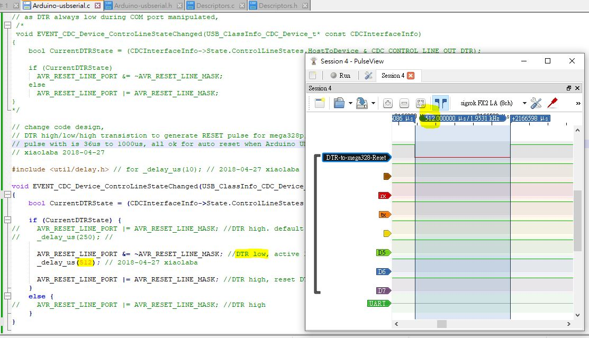
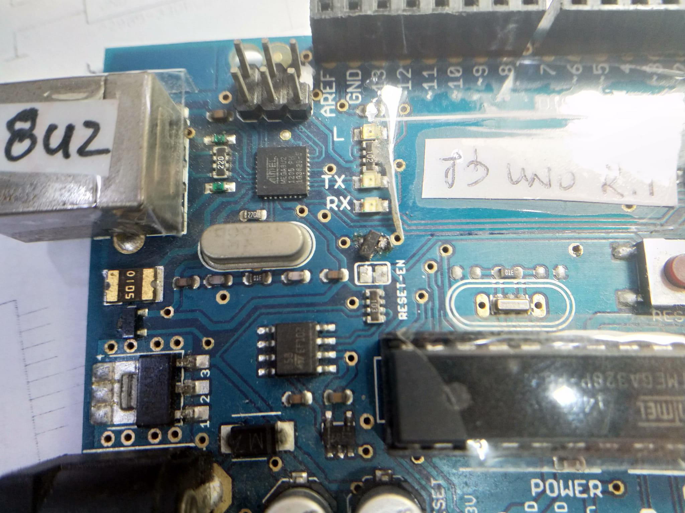
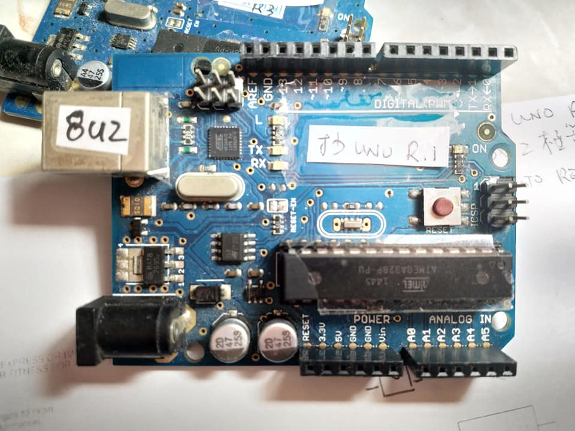
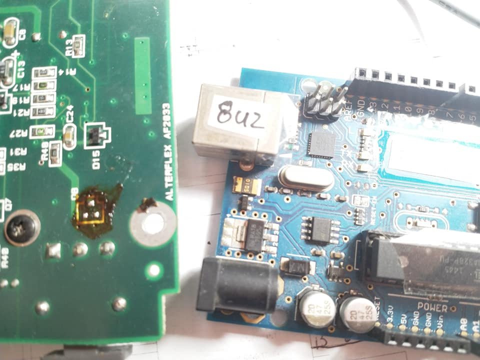
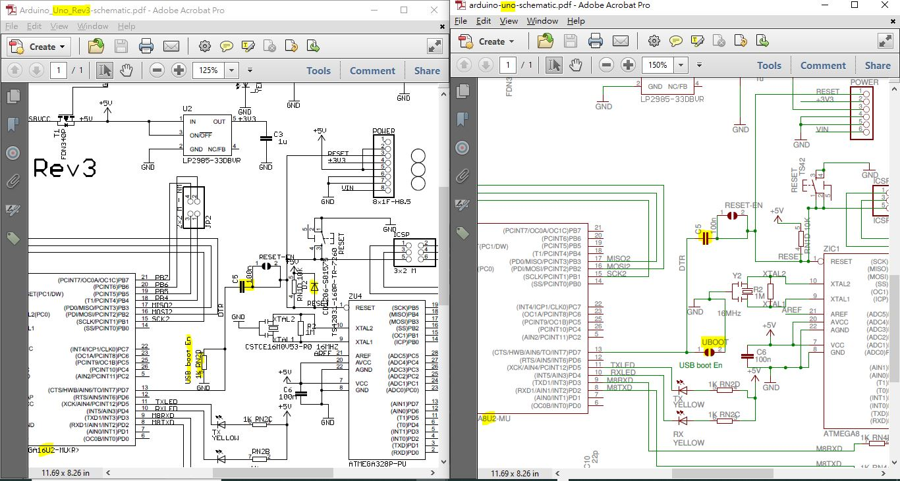

# UNO-R1-R3-reset-circuitry, makes it better  
recovered from old archive of dead harddisk   
written by xiaolaba, 2018   
...   
arduino-uno-schematic.pdf  
  
...  
Arduino_Uno_Rev3-schematic.pdf  
  
...  
ATmega8U2_16U232U2-Complete-Datasheet.pdf  
  
...  
c5_used_diode.JPG  
  
...  
DTR-to-mega328-RESET.JPG  
  
...  
github_build_README.md.bat  
  
...  
github_link_build_filelist.bat  
  
...  
missing_cap_diode.JPG  
  
...  
R1adding10k.JPG  
  
...  
R1R3_bottom.jpg  
  
...  
R1R3_diff.JPG  
  
...  
R1R3_top.jpg  
  
...  
README.md  
  
...  
UNO_8U2_16U2_DFU.pdf  
  
...  
uno_diode.jpg  
  
...  
uno_faulty_board.jpg  
  
...  
uno_missing_cap.jpg  
  
...  
UNO_R3_R1.JPG  
  
...  
UNO_Rev1_2_3_mod.pdf  
  
...  
USB-DFU-Bootloader-Datasheet.pdf  
  
...  
